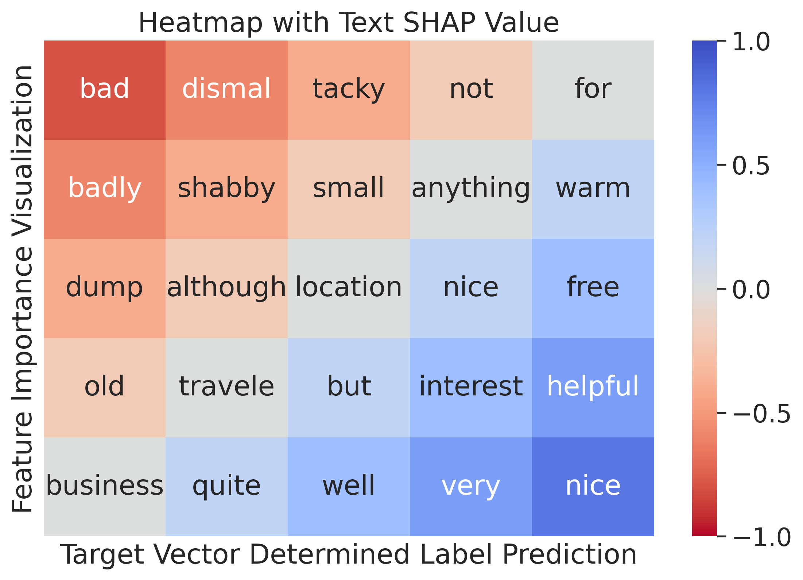
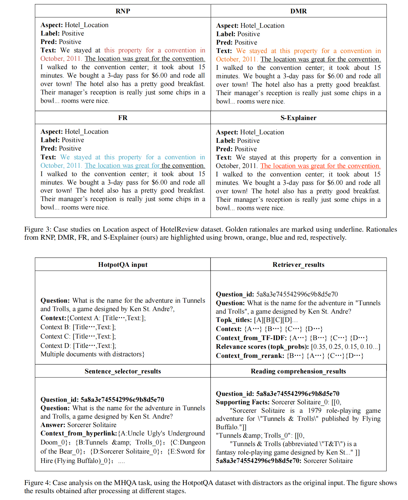

# S-Explainer: A Self-Explaining NLP Framework Based on Cooperative Rationalization and Multi-Hop Evidence Reasoning 
This is the documentation for the paper, where we mainly present the code for Selective Rationalization (SR) and Multi-Hop Question Answering (MHQA) reasoning tasks, along with the visual results for RQ1, RQ2, and RQ3.


## Environments
RTX3090、PyTorch 1.11.0、Python  3.8(ubuntu20.04)、Cuda  11.3

Create an environment with: conda create -n S-Explainer python=3.8

Then activate it: conda activate S-Explainer

Install pytorch: 

```
# CUDA 11.3
conda install pytorch==1.12.1 torchvision==0.13.1 torchaudio==0.12.1 cudatoolkit=11.3 -c pytorch
```

Install other packages: `pip install -r requirements.txt`

## Selective Rationalization (SR)

### Datasets  

To the best of our knowledge, although the dataset used in the experiments is publicly available, it is preferable to obtain authorization for the dataset from the original authors via email.

- **Beer Reviews**: You can get it [here](http://people.csail.mit.edu/taolei/beer/). Then place it in the `./data/beer` directory. 

- **Hotel Reviews**: You can get it [here](https://people.csail.mit.edu/yujia/files/r2a/data.zip).  

1. Find the following files from the `data/oracle` directory and place them in the `./data/hotel` directory:
   - `hotel_Location.train`
   - `hotel_Location.dev`
   - `hotel_Service.train`
   - `hotel_Service.dev`
   - `hotel_Cleanliness.train`
   - `hotel_Cleanliness.dev`

2. Find the following files from the `data/target` directory and place them in the `./data/hotel/annotations` directory:
   - `hotel_Location.train`
   - `hotel_Service.train`
   - `hotel_Cleanliness.train`

3. Word embedding file: [`glove.6B.100d.txt`](https://nlp.stanford.edu/projects/glove/), and place it in the `./data/hotel/embeddings` directory.

---

The `beer_test.json` and `hotel_test.json` are the processed data we have prepared. 

- **Beer Dataset**:  
  The Beer dataset originally has five aspects:
  - 0 represents **Appearance**
  - 1 represents **Aroma**
  - 2 represents **Palate**
  - 3 represents **Taste**
  - 4 represents **Overall rating**
  
  The `'raw'` key contains the original review data. As shown in Table 1 of our paper, we selected **Aspect 0 (Appearance)**, **Aspect 1 (Aroma)**, and **Aspect 2 (Palate) **for testing.
  
  Example of processed data in `beer_test.json`:
  
  - **Aspect 0**: `[[0, 29]]`
    - `clear, burnished copper-brown topped by a large beige head that displays impressive persistence and leaves a small to moderate amount of lace in sheets when it eventually departs`
  - **Aspect 1**: `[[29, 52]]`
    - `the nose is sweet and spicy and the flavor is malty sweet, accented nicely by honey and by abundant caramel/toffee notes`
  - **Aspect 2**: `[[80, 92], [92, 99]]`
    - `80-92: alcohol the mouthfeel is exemplary; full and rich, very creamy`
    - `92-99: creamy mouthfilling with some mouthcoating as well`

---

- **Hotel Dataset**:  
  Similarly, for the hotel dataset, we selected **Location**, **Service**, and **Cleanliness** as Aspects 0, 1, and 2, respectively.
  
  The processed JSON files include the range of words (tokens) selected for each dimension, i.e., the selected basic rationales.

## Running Example  

### Beer Datasets

#### Appearance:  

Please run the following command:

```bash
python -u run.py --correlated 1 --lr 0.00003 --batch_size 128 --gpu 0 --sparsity_percentage 0.092 --epochs 400 --aspect 0 --save 1 | tee logs/beer/output_beer_aspect0_log.txt
```

You will get the following result:

```plaintext
Parameters:
	ANNOTATION_PATH=./data/beer/annotations.json
	ASPECT=0
	AVERAGE_TEST=1
	BATCH_SIZE=128
	CELL_TYPE=GRU
	CLS_LAMBDA=0.9
	CONTINUITY_LAMBDA=12.0
	COOPERATIVE_GAME=0
	CORRELATED=1
	DATA_DIR=./data/beer
	DATA_TYPE=beer
	DIS_LR=1
	DROPOUT=0.2
	EMBEDDING_DIM=100
	EMBEDDING_DIR=./data/hotel/embeddings
	EMBEDDING_NAME=glove.6B.100d.txt
	EPOCHS=10
	GPU=0
	HIDDEN_DIM=200
	LR=3e-05
	LR_LAMBDA=1
	MAX_SEQ_LENGTH=256
	NUM_CLASS=2
	NUM_GEN=2
	NUM_LAYERS=1
	OUTPUT_DIR=Ture
	SAVE=0
	SEED=12252018
	SHARE=1
	SPARSITY_LAMBDA=11.0
	SPARSITY_PERCENTAGE=0.092
	VISUAL_INTERVAL=50
	WRITER=./tensorboard
correlated
Dataset: Beer Review
train samples has 215282
train data: 202385 positive examples, 12897 negative examples.
Make the Training dataset class balanced.
After balance training data: 12897 positive examples, 12897 negative examples.
Dataset: Beer Review
heldout samples has 29806
heldout data: 28488 positive examples, 1318 negative examples.
Make the Training dataset class balanced.
After balance training data: 1318 positive examples, 1318 negative examples.
Dataset: Beer Review
annotation samples has 936
annotation data: 923 positive examples, 13 negative examples.
share=1

Train time for epoch #0 : 11.858496 second
training epoch:0 recall:0.5689 precision:0.5049 f1-score:0.5350 accuracy:0.5056
Validate
dev epoch:0 recall:0.3725 precision:0.5083 f1-score:0.4299 accuracy:0.5061
Validate Sentence
dev dataset : recall:0.9924 precision:0.4992 f1-score:0.6643 accuracy:0.4985
Annotation
annotation dataset : recall:0.3521 precision:0.9878 f1-score:0.5192 accuracy:0.3568
The annotation performance: sparsity: 10.1829, precision: 6.5311, recall: 3.5921, f1: 4.6350
Annotation Sentence
annotation dataset : recall:0.9935 precision:0.9860 f1-score:0.9897 accuracy:0.9797
Rationale
rationale dataset : recall:0.8982 precision:0.9881 f1-score:0.9410 accuracy:0.8889
...
...
Train time for epoch #285 : 11.641702 second
training epoch:285 recall:0.7169 precision:0.7876 f1-score:0.7506 accuracy:0.7618
Validate
dev epoch:285 recall:0.7185 precision:0.7398 f1-score:0.7290 accuracy:0.7329
Validate Sentence
dev dataset : recall:0.7868 precision:0.6690 f1-score:0.7232 accuracy:0.6988
Annotation
annotation dataset : recall:0.8072 precision:0.9973 f1-score:0.8922 accuracy:0.8077
The annotation performance: sparsity: 12.2051, precision: 82.9052, recall: 54.6533, f1: 65.8781
Annotation Sentence
annotation dataset : recall:0.9220 precision:0.9965 f1-score:0.9578 accuracy:0.9199
Rationale
rationale dataset : recall:0.8570 precision:0.9975 f1-score:0.9219 accuracy:0.8568

Train time for epoch #286 : 11.854397 second
training epoch:286 recall:0.7184 precision:0.7899 f1-score:0.7525 accuracy:0.7637
Validate
dev epoch:286 recall:0.7056 precision:0.7358 f1-score:0.7204 accuracy:0.7261
Validate Sentence
dev dataset : recall:0.7914 precision:0.6686 f1-score:0.7248 accuracy:0.6995
Annotation
annotation dataset : recall:0.7941 precision:1.0000 f1-score:0.8853 accuracy:0.7970
The annotation performance: sparsity: 11.9397, precision: 83.4242, recall: 53.7998, f1: 65.4143
Annotation Sentence
annotation dataset : recall:0.9220 precision:0.9965 f1-score:0.9578 accuracy:0.9199
Rationale
rationale dataset : recall:0.8559 precision:0.9975 f1-score:0.9213 accuracy:0.8558

Train time for epoch #287 : 11.836842 second
training epoch:287 recall:0.7191 precision:0.7902 f1-score:0.7530 accuracy:0.7641
Validate
dev epoch:287 recall:0.7102 precision:0.7373 f1-score:0.7235 accuracy:0.7286
Validate Sentence
dev dataset : recall:0.7656 precision:0.6795 f1-score:0.7199 accuracy:0.7022
Annotation
annotation dataset : recall:0.7985 precision:0.9986 f1-score:0.8874 accuracy:0.8002
The annotation performance: sparsity: 12.5270, precision: 82.7172, recall: 55.9679, f1: 66.7629
Annotation Sentence
annotation dataset : recall:0.9047 precision:0.9964 f1-score:0.9483 accuracy:0.9028
Rationale
rationale dataset : recall:0.8440 precision:0.9974 f1-score:0.9143 accuracy:0.8440

At epoch=286, the annotation performance: sparsity: 11.9397, precision: 83.4242, recall: 53.7998, f1: 65.4143. Compared to the results of RNP, DMR, FR, and Inter-RAT, it has already achieved SOTA (State-of-the-Art).
    ...
```

After our efforts to search for the optimal hyperparameters, we have found the best experimental settings. The specific running commands can be found in the `run_parameters.txt` file. The experimental log results and tensorboard visualizations are available in TensorBoard. The model selection results can be found in `annotation_test_results.txt` and the earlier JSON files. The model save path is under the `trained_model` folder.

### Hotel datasets
#### Cleanliness: 

Please run the following command:

```bash
python -u run.py --data_type hotel --lr 0.00007 --batch_size 1024 --gpu 0 --sparsity_percentage 0.1 --sparsity_lambda 10 --continuity_lambda 10 --epochs 200 --aspect 2 --save 1| tee logs/hotel/output_hotel_aspect2_log.txt
```

## Model_eval
For Beer datasets aspect 0 please run:

```bash
python model_eval.py --data_type beer --gpu 0 --aspect 0
```

You will get the following result:

```plaintext
Dataset: Beer Review

annotation samples has 936

annotation data: 923 positive examples, 13 negative examples.

Annotation

annotation dataset : recall:0.7985 precision:0.9986 f1-score:0.8874 accuracy:0.8002

The annotation performance: sparsity: 11.1572, precision: 87.6619, recall: 52.8276, f1: 65.9262

Consistent with Table 1 in the paper，same applies to the hotel dataset.
```

Please note that you need to specify the test model path in the code file, such as:

```bash
python model_eval.py --data_type beer --gpu 0 --aspect 0
```

 ## Multi-Hop Question Answering (MHQA) reasoning task

## Setup and Evaluation for HotpotQA

By running `quick_start_hotpot.sh`, you can easily set up and run an assessment on the HotpotQA full wiki (for the first 100 questions). The script includes:
1. Downloading the model
2. Downloading the evaluation data
3. Running the evaluation script

Please run the following command:

```bash
python eval_main.py \
--eval_file_path data/hotpot/hotpot_fullwiki_first_100.jsonl \
--eval_file_path_sp data/hotpot/hotpot_dev_distractor_v1.json \
--graph_retriever_path models/hotpot_models/graph_retriever_path/pytorch_model.bin \
--reader_path models/hotpot_models/reader \
--sequential_sentence_selector_path models/hotpot_models/sequential_sentence_selector/pytorch_model.bin \
--tfidf_path models/hotpot_models/tfidf_retriever/wiki_open_full_new_db_intro_only-tfidf-ngram=2-hash=16777216-tokenizer=simple.npz \
--db_path models/hotpot_models/wiki_db/wiki_abst_only_hotpotqa_w_original_title.db \
--bert_model_sequential_sentence_selector bert-large-uncased --do_lower_case \
--tfidf_limit 500 --eval_batch_size 4 --pruning_by_links --beam_graph_retriever 8 \
--beam_sequential_sentence_selector 8 --max_para_num 2000 --sp_eval --sampled
```

## Testing on Full HotpotQA Dataset

If you want to test on the full HotpotQA dataset, run:

```bash
python eval_main.py \
--eval_file_path data/hotpot/hotpot_fullwiki_data.jsonl \
--eval_file_path_sp data/hotpot/hotpot_dev_distractor_v1.json \
--graph_retriever_path models/hotpot_models/graph_retriever_path/pytorch_model.bin \
--reader_path models/hotpot_models/reader \
--sequential_sentence_selector_path models/hotpot_models/sequential_sentence_selector/pytorch_model.bin \
--tfidf_path models/hotpot_models/tfidf_retriever/wiki_open_full_new_db_intro_only-tfidf-ngram=2-hash=16777216-tokenizer=simple.npz \
--db_path models/hotpot_models/wiki_db/wiki_abst_only_hotpotqa_w_original_title.db \
--bert_model_sequential_sentence_selector bert-large-uncased --do_lower_case \
--tfidf_limit 500 --eval_batch_size 4 --pruning_by_links --beam_graph_retriever 8 \
--beam_sequential_sentence_selector 8 --max_para_num 2000 --sp_eval
```

Due to the huge amount of data, you need to wait about 15 minutes.

Then, you will get the following results:

```plaintext
{'em': 0.7067966239027684, 'f1': 0.8318873757783022, 'prec': 0.7613180885780131, 'recall': 0.7421444532461545, 'sp_em': 0.65169480081026334, 'sp_f1': 0.8885390258327606, 'sp_prec': 0.8103758721584524, 'sp_recall': 0.7325846435805953, 'joint_em': 0.48857143821742063, 'joint_f1': 0.7566774960171196, 'joint_prec': 0.679462464277477, 'joint_recall': 0.5987834193329556}
```

## View the Search Results

If you want to view the search results, you can quickly test the first 100 data, and the results are stored in the `outputjson` file.

- Save TFIDF Retrieval results to `./outputjson/01/tfidf_results.json`
- Save graph-based Retrieval results to `./outputjson/02/selector_results.json`
- Save reader results to `./outputjson/03/reader_results.json`
- Save sentence selector results to `./outputjson/04/sequence_sentence_selector_results.json`

Just run:

```bash
bash results_save.sh
```


## RQ2

We use SHAP values to calculate the weights of the words in the rationale to find the model's preference when choosing reasons. Similar to the IMDB dataset, we use the pre-trained models Bert and GRU to train the sentiment classifier, as shown in the Emotion classification multiclass example.ipynb notebook



We provide the example code of HEDGE interpreting the LSTM, CNN, and BERT model on the hotel dataset. We adopt the BERT-base model built by Huggingface: [Huggingface Transformers](https://github.com/huggingface/transformers).

In each folder, run the following command to generate explanations on the test data for a well-trained model.

```bash
python hedge_main_model_imdb.py --save /path/to/your/model
```

We save the start-end word indexes of text spans in a hierarchy (in the order of importance) into the `hedge_interpretation_index.txt` file.

To visualize the hierarchical explanation of a sentence, run:

```
python hedge_main_model_imdb.py --save /path/to/your/model --visualize 1(the index of the sentence)
```

If you want to see more visualizations, check out `visualization_sentence_23.png` and `visualization_sentence_31.png`. These files are located under `HEDGE-master/bert/other_png`, and they are all generated under the fine-tuned BERT model.

### RQ3

Supplementary explanation for formula 12 in the paper

For graphs where the answer can only be obtained through a single path, we replace the attention output value of a certain node $v_k$ in the graph, observe and analyze the impact on the final result, in order to identify the key nodes in the graph and calculate the contribution of those nodes. Replace the attention output value of node $v_k$ and calculate the contribution of node $v_k$, mathematically expressed as follows:

### Equation 1:

$$
h_k^{\prime}=\sum_{j \in \mathcal{N}(k)} \alpha_{k j} h_j
$$

**Where:**

- $\mathcal{N}(k)$ is the set of neighbor nodes of node $k$.
- $\alpha_{kj}$ is the attention weight between node $k$ and node $j$.
- $h_j$ is the feature representation of node $j$.

### Equation 2:

$$
\Delta E_k=\left|E-E^{\prime}\right|
$$

**Where:**

- $\Delta E_k$ is the contribution of node $k$.

- $E$ is the reasoning result before replacement.

- $E'$ is the reasoning result after replacement.

  ##### More visualization results are shown below:



```python
# This is just a simplified version of our code implementation, made for easy reading and understanding. We will further improve it in future. Thank you for your interest in our work!
```
